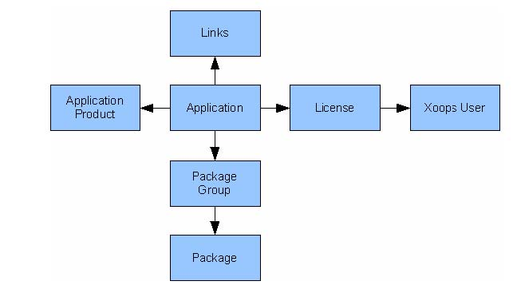

# 4.0 Operating Instructions

#### What is XAsset

XAsset is a Xoops module designed for digital media sales and distribution. Initially this was designed for Shareware authors but the module architecture can also be extended to selling and distributing any digital asset such as MP3 files, EXE files or PDF documents. Anything that can be downloaded can be managed from xAsset.

As can be seen, the Application is central to xAsset. The application can be seen as the top level object that describes a particular application that is being sold. Another way of looking at an application is thinking of it as a Music album. An album could have multiple tracks, in this case Application Products. An Application product can either describe the whole album (£9.99 for the whole album) or it can describe an individual track (£0.99 per track for example). The Application Products describes your price structure for the Application. An Application can have multiple Application Products.

The Applications physical attributes (ie files) are described via the Package Groups and Packages. Packages describe files where a Package Group groups together Packages. An application can have multiple Package Groups and a Package Group can contain multiple files.

Tax always creeps up when selling anything! xAsset supports multiple tax levels by defining geographic tax regions and setting appropriate tax rates for each region. The Tax structure is as follows:
* Each Country can have many zones defined. This structure could be used to describe the USA, as a country, and its states as zones.
* A tax region can be defined by pairing a Country and a Zone. Tax Regions are used to describe geographic locations where extra tax handling is required. An example would be Region 1 where USA is defines with all zones. This describes a federal tax for example. Region 2 can then be defined to group the USA and New York zone together. This can then define an additional state tax. When a client chooses New York as his state/zone, she will be liable for federal tax (Region 1) and a state tax (Region 2).
* Each application must have a Tax Class defined, ie "Taxable Goods". This Tax Class can then be set a Tax Rate depending on the Tax Region. This allows you to set the Tax Class "Taxable Goods" and assign a 5% federal tax (Region 1) and a 7% tax (Region 2) using the above example. Non taxable goods must be assigned a tax of 0%.
* Each client must specify both their Country of Origin and a State/Zone, if one is defined. This is then used to calculate the appropriate tax.

Please read the Tax & Rates section for more information.

#### Item Ordering Workflow

There are two types of products that can be sold through xAsset:
1. Media based assets. This can be a pdf file, a zip file, mp3 file etc. Any file that can be bought and downloaded.
2. Service asset. This is a service and as such does not have a corresponding file and cannot be downloaded.
 
#### Asset Based Order Workflow

An Application product can have a Package Group assigned to it. A Package group can contain any number of files. Once an application product is ordered it is placed in the Order table and can immediately be seen by the client in the My Downloads section once the client has proceeded to the payment gateway.

Items shown in the My Downloads section only be live and downloadable once the payment gateway has confirmed that a payment was received. In the case of Paypal this is triggered via an IPN callback.

#### Permission Based Order Workflow

Alternatively, an application product can be instructed to add the client to a Xoops Group. Where no Package Group is specified, the client is added to the specified Xoops Group once a successful message is received from the payment gateway.

Please note that the above two mechanisms can be combined. ie, an application product can be specified contains a package group and at the same time adds the client to the specified Xoops Group.

#### Simple Setup - No Tax

xAsset very quick install when tax features are not intended to be used. This should be the general setup used.

By default xAsset will install the USD and GBP currencies for your. If you require to change this then click on the Currencies tab to setup at least one currency to use as a default. Please see the Currencies for more details. Press create to add this currency.

**2. Configure xAsset**

 

Go back into xAsset by clicking the xAsset logo on the left hand site of the Control Panel. Click on the "xAsset Configuration" link at the top of the page. Select your Base Currency, the Email Notification Group and Usergroup User List . Click on modify to continue.

**3. Create an Application/Item**
  

Click on the Application Tab in the xAsset Control Panel to add an Application or Product.
* Tick the Sample Products box if the Application product has a demo part. This can be a 30 second sample of your track for example. 
* Tick the List in Main Menu box if this Application Product is to be listed under this module's main menu on the front page. 
* If the List in Main Menu box is ticked then define the link text in Main Menu Name. 
* Xoops User Group Access defined which Xoops group has access to this application.

Once an application is created you will be able to add products to it by scrolling further down the Application screen in the xAsset Control Panel.

 

**4. Install & Enable the Payment Gateway.**

 

Click on the Payment Gateways tab in the xAsset Control Panel. tick the check box next to the Paypal gateway and click the enable button.

 

Once enabled you should see the above screen. Populate the required fields with your Paypal details.
Please note that the Paypal payment gateway was designed to work with Paypal Merchant accounts only.

 

These are the minimal steps required to start selling with xAsset.

#### Tax Setup - Overview

***XAsset Quick Install***
1. Setup Currencies

Click on the Currencies tab to setup at least one currency to use as a default. Please see the Currencies for more details. Press create to add this currency.
2. Configure xAsset

Go back into xAsset by clicking the XAsset logo on the left hand site of the Control Panel. Click on the "xAsset Configuration" link at the top of the page. Select your Base Currency, the Email Notification Group and Usergroup User List . Click on modify to continue.

Return to the XAsset Control Panel and click on the Preferences link in the top left of the navigation bar. Select whether the above columns are displayed when displaying Application Products.

3. Add Regions

Add regions to specify geographic tax locations. Tax Rates will be defined against these Tax Regions.

4. Add Zones.

Next add your zones by clicking on the Zones tab in the xAsset Control Panel. Zones can break down a country into states or regions. If a country does not require any zones then none are needed. In such a situation, the customer will be asked to type in the state/region as opposed to select from a predefined list of zones.

5. Setup Tax Zones and Link to Regions

Next click on the Taxes & Rates tab on the xAsset navigation bar.
Tax Zones link country zones (or states) and regions to define specific tax rates for that region. This can be used to define a country wide sales tax or defining a zone specific tax... or both.
Tax Zone can also be set countrywide be selecting All Zones when adding a tax zone.

6. Setup Taxes & Rates
 
Click on the Taxes & Rates icon in the xAsset Control Panel and add a Tax Class. Press create to continue.

Once a Tax Class is added you will be able to add a Tax rate. The latter will not appear unless there is at least one Tax Class and Tax Region defined. Define your Tax Rates as required for your Region and Tax Class. Press create to continue.

7. Create an Application/Item

 

Click on the Application Tab in the xAsset Control Panel to add an Application or Product.

* Tick the Sample Products box if the Application product has a demo part. This can be a 30 second sample of your track for example. 
* Tick the List in Main Menu box if this Application Product is to be listed under this module's main menu on the front page. 
* If the List in Main Menu box is ticked then define the link text in Main Menu Name. 
* Xoops User Group Access defined which Xoops group has access to this application.

Once an application is created you will be able to add products to it by scrolling further down the Application screen in the xAsset Control Panel.

 

Please read the Application Product page for more details on this. Press create to continue.
8. Install & Enable the Payment Gateway.

 

Click on the Payment Gateways tab in the xAsset Control Panel. tick the check box next to the Paypal gateway and click the enable button.

 

Once enabled you should see the above screen. Populate the required fields with your Paypal details.

Please note that the Paypal payment gateway was designed to work with Paypal Merchant accounts only.

 

These are the minimal steps required to start selling with xAsset.

#### Control Panel Index Page

 

The Control Panel Index page is the default page when entering the xAsset Control Panel. It shows a quick summary of how many applications are defined, licenses have been added, files, links and downloads in total.

Various aspects of xAsset can be configured by clicking on the appropriate tabs such as Applications, Licenses, Links etc.

Global aspects of xAsset can also be defined via the Preferences and xAsset Configuration links.

#### General Configuration

 

The xAsset Properties page can be accessed from xAsset Control Panel and by clicking the Properties link at the top left of the Control Panel navigation tabs.

* Show Min License : If enabled will show the Min License column in the xAsset product page. 
* Show Max Downloads : if enabled will show the Max Downloads column in the xAsset product page. 
* Show Max Days : If enabled will show the Max Days column in the xAsset product page. 
* Show Expires Date : if enabled will show the Expires Date in the xAsset product page.
* Membership expiry client warning sets the number of days before a member's subscription expires before a warning email is sent. See Automatic Expiring Subscriptions for further details.

 

* Order Complete timeout is the length of time the order complete page (shown after a client presses the checkout button on their cart) is shown.
* xAsset redirected clients to the xAsset index page on order completion. This redirection location can be overridden by keying in an alternative address (ie http://www.mysite.com).
* Secret Encrypt Key is the encryption key used to sign FLV videos. A random unique key is generated when installing xAsset for the first time.
* Enable Bandwidth Throttling. By default this is set to No. If you wish to throttle FLV Video streaming bandwidth then set this to Yes and set the throttling rate. Please note that Bandwidth Throttling is still experimental and might not function as expected on all platforms.
* Bandwidth Throttling Rate controls the rate at which FLV videos are streamed to each users. Bandwidth throttling is important because it controls the rate at which videos are streamed. A typical FLV video requires an upload bandwidth of 100k per second to play back smoothly. If no bandwidth throttling is set then users with very fast connections could use all your bandwidth this affecting other users. Throttling insures that your bandwidth is shared equally amongst many users. By default this is set to 128 k/second. Increase this value if your videos require more bandwidth or decrease if your videos require less bandwidth. Please note that setting this value too low will result in choppy playback. You might need to experiment to find the ideal setting (although 128k/s should do fine for most videos).

 

* Product Window Width/Height specify the width/height of the application product detail screen that is shown when an application product has a HTML Description. This product description is shown in a popup window.

 

The xAsset Configuration page can be accessed from the Control Panel by clicking the xAsset configuration link at the top left of the navigation tabs.

* User Group List: This option is for future use. 
* Email Notification Group: This is the Xoops Group to which sales notifications will be emailed to. 
* Base Currency : This is the base currency which will be presented to the user by default.

#### Application Setup

 

The Applications tab shows all defined applications in xAsset. This screen also shows all defined Application Products for each application. In the above example we have four Application Products (Prod1..Prod4) defined under PSP News for example.

The Application row describes:

* ID : The Application ID
* Application : The Application Name.
* Products : Number of Application Products for this Application.
* Downloads : Total File downloads for this Application. More detail can be seen in the Download Stats page.
 
The Application Product row describes:

* Code : The defined Application Product Code.
* Tax Code : Defined Tax Class for this Application Product.
* Base Currency : Base currency for this Application Product. Please see the Currencies section for more detail. 
* Unit Price : The Application Product price in the Base Currency. 
* Min Unit : This is the minimum number of quantities that can be selected for this price. Designed for bulk discounts for example.
* Max Downloads : Is the maximum number of times a file can be downloaded. This can be used to limit how many times an MP3 can be downloaded. 0 means that there are no limits on download.
* Expires defines where this Application Product will expire. Application products will no longer be visible to the user once the offer has expires. Can be used for limited time promotions.

#### Adding an Application

 

* Application Name : Name of the Application as it appears to the user.
* Application Description : Short text description as it appears to the user.
* Platform : Short text description to define application platforms (if applicable).
* Version : Version number.
* Tick the Has Sample Products box if the Application product has a demo part.
This can be a 30 second sample of your track for example. This will show an extra column in the application product grid on the shop frontpage. 
* Tick relevant Group permissions in Xoops User Group Access. 
* Application Image can optionally contain the path to an images to represents this application. Image paths must be absolute (i.e.
/home/yoursite/html/images/app1.gif).

 

* HTML Description : Add HTML text here to fully describe your product. As this is HTML it can contain images, links etc... The HTML Description area can also parse specific tags:

 

* List all products is ticket by default. When ticked, xAsset will automatically generate a table with all application products. Untick this if you do not want an auto generated list of products but want to display your own list instead.
* Product List Template enables each application to provide its own Smarty template on how its products are displayed. This overrides the default product listing method. Extra control is provided for positioning by using the {TAG.LIST} in the Application Description.

HTML Description Tag replacements

The HTML description area recognises and parses the following general tags:

| 0:0 | 1:0 |
| -- | -- |
| 0:2 | 1:2 |
| 0:3 | 1:3 |
| 0:4 | 1:4 |
| 0:5 | 1:5 |
| 0:6 | 1:6 |
| 0:7 | 1:7 |

TAG
Description
{X_MODULE}
Returns the module name (xAsset)
{X_SITEURL}
Returns XOOPS_URL
{X_DOCROOT}
Returns a URL to xAsset/files
{X_SITENAME}
Returns the site name as setup in Admin -> Preferences
{X_ADMINMAIL}
Returns the admin email as setup in Admin -> Preferences
{X_MODULE_URL}
Returns a URL to the xAsset module directory
The following specialised tags are also provided when to describe products:
TAG
Description
{TAG.LIST}
Works in conjunction with Product List Templates by placing the application product list (as specified by the $smarty template in Product List Template) where specified.
{TAG.PROD.BUY[option image url]}
Finds an application product with code PROD and generates a Buy Now button for it. You can optionally supply an image URL to be used for the button. If an optional image URL is not supplied then

the default Buy Now button is used.
{TAG.PROD.PRICE}
Finds an application product with code PROD and returns a formatted price using the currently selected currency format.
{TAG.PROD.DESC}
Finds an application product with code PROD and returns the product description.
{TAG.PROD.VIDEO[package id]}
Generates a Flash Player in place of the token and prepares the video specified in [package id] for playing.
Examples:
1. An application with a product code of PROD1. To generate a Buy Now button using the image in http://domain.com/image/buynow.gif:
{TAG.PROD1.BUY[http://domain.com/image/buynow.gif]}

Adding An Application Product
Once at least one application as been defined it becomes possible to add Application Products.
Please note that you will not be able to add an application product unless: a currency has been defined and set as the default currency, a tax class has been set and finally an application has been defined.

* Enabled : An Application Product is shown on the front page when enabled. Untick Enabled to hide the Application Product from the shop page.
* Application : The Application to which the Application Product is added to.
* Tax Class : The respective Tax Class.
* Display Order : The order in which the Application Product will be displayed in the Evaluation screen to your users. Application Products with lower order values will be displayed first.
* Base Currency :The base currency in which the Unit Price is defined. This is used in multi-currency sites for currency value conversions.
* Old Unit Price : The old unit price if the current Unit Price has been discounted. This will be shown to the user as a price reduction. (not used yet).
* Minimum Sales Units : The minimum quantity of items that are sold for the Unit Price listed. Can be used for bulk discounts.
* Max Access : Maximum number of times files can be downloaded. Leave at 0 for infinite.
* Max Days Access : Number of days from day of purchase where files can be downloaded. Leave blank for no restriction.
* Expire Date : The date at which the Application Product expires. Can be used for short term promotions.
* HTML Description : Plain or HTML text that describes this product. This text is only shown when used in conjunction with {TAG.PROD.DESC} tag.
* Purchase Package Group. This defines which Package Group will be available to the client for download once her purchase is complete.
* Sample Package Group. This defines which package Group will be available to the client for download as a sample. These can be downloaded immediately from the Application page without a purchase.
* Add to Xoops User Group. Add the buyer to this Xoops user group on purchasing this application product. This is ideal for selling membership to premium areas of your site for example.
* Group Membership Expires. Defines a membership expiry date, if any. Please note that quantities ordered have an influence over expiry dates. If a user orders two quantities of an application product that has en expiry date of One Month this will in effect expire in two months. Please note that this setting has no effect
unless a group has been defined in Add to Xoops User Group.
* Extra Instructions provides a mechanism where each application product can specify a special instruction that will be included in the order confirmation sent to the client. This can can include download instructions, for example.

* The Buy Now link generates HTML code than can be copied and pasted to any place on either your website or any other website. Uses can include the generation of Buy Now images that can be placed as banners that direct clients who click to your xAsset cart.

#### Packages and Groups

Packages represent files that are to be distributed. Be they ZIP, EXE or MP3 files. Packages are grouped in a Package Group. Each Application can have any number of Package Groups. This allows you to sell multiple files per application group.
Please note the green tick on the right of the Groups & Packages package (xAsset PDF manual) provides a link to download the shown package. This link can be copied and placed anywhere on your site (as part of a news article for example). Also note the warning image to the right of it. This indicates that this is a protected package and it cannot be downloaded unless it has been purchased.
Click on the Package Packages tab in the xAsset Control Panel to access the Package and Package Groups page. The main table lists Applications that have Package Groups. The selected Application is highlighted in bold. Other Application's Package Groups can be accessed and managed by clicking on the required application in the above table.
Adding a Package Group.
· Group Name : The name displayed to the site visitor for this Application Group.
· Description : A Brief Description.
· Version : Version Number.

Adding a Package
* Package Group : Select the previously defined or required Package Group to which this Package will be added to.
* Display Name : This will be the text displayed to the site visitor for the file link.
* Actual File Path : This is the actual path of the file on the webserver. It is strongly advised that these files be placed outside your public_html or www directory to prevent direct linking. It is strongly advised that a new directory be created that is in the same directory as public_html (but not inside it) and file be placed there. This will prevent direct file linking to your assets. Please note that the Actual File Path is the physical path to your file... i.e. /home/mydomain/public_html/files/myfile.mp3 and not a URL. If you specify a URL then the download mechanism will not work.
* File Size : The size of the file.
* File Type : File Type.
* This is a Video File : Check this box when adding a video file as this determines if the file is downloadable or for playback only. Video files that have this unchecked will be downloaded. When checked, video files will be streamed via the xStreamer Flash Player.
* Protected : This must be ticked if you wish your file to be securely downloaded. Files that are protected cannot be downloaded unless they have been purchased by the client and none of the conditions (ie max downloads count, expiry date) have been met. Leave a file unprotected if you wish to use the download mechanisms in xAsset but to make the download link available outside of xAsset's shop interface.

Tax Regions
Tax Regions can be managed by clicking on the Regions tab on the xAsset navigation tab.
Tax regions are used to define geographic regions where tax rates differ. Tax Rates are then defined against Tax Regions.
Adding a Region
* Region : Region name. * Description : A brief description.

Countries
Click on the Countries tab to maintain and add to the Countries list. The main table shows all defined countries with their respective ISO code. These can be edited and deleted as required.
Please note that any country you wish to sell to must be defined in this list.
Adding a Country
* Country Name : Name of the country as it will be presented to the website user.
* ISO2 Code : The ISO2 country code of that country.
* ISO3 Code : The ISO3 country code of that country.

Zones
Zones can be managed from the xAsset Control Panel and by clicking on the Zones tab on the navigation tab.
Zones are used to describe different states or regions in a country. An example of this would be the United States has states. These states can be defined as Zones.
Zones are not required for all countries, as the there is an All Zones option that can be selected when defining a tax zone. Zones should be only defined for countries that have differing tax rates for its zones, as is the case in the United States or Canada.
Adding a Zone
* Country Name : Select a Country for which the Zone is to be added.
* Code : A short code to identify the Zone.
* Name : The Zone name.

Taxes & Rates
The Taxes & Rates page can be accessed by clicking the Taxes and Rates tab in the xAsset Control Panel.
Taxes & Rates are used to defined what types of sales tax is applied to each Application Product. Sales Tax Rates are determined by the country of origin of your customer. Customers from the EU, for example need to be charged Value Added Tax (VAT) for the appropriate items from any supplier in the EU.
A Tax Rate defines the percentage of tax applied to each Application Product. A Tax Class is then used to link the Tax Rate and the Application Product and the Tax Region. This allows you, for example, to have one Sales Tax that is defined for two regions, say the EU and the USA. The Tax rate for the EU will be at 17.5% and the USA Tax Rate would be 11% for example. The correct tax rates is then determined by the country from which your customer is from.
Additional tax regions can be defined for zones to add additional tax rates for each zone.
Tax Zones describe a specific Tax Zone for a specific country and zone. As can be seen from the above example, a region can either group a Country and all zones under a country, for a federal tax for example, or a Country and a specific state can be defined in a region to describe a state tax. This can be subdivided further by defined cities as zone, for example to define a city tax... etc.

Adding a Tax Zone.
Please note that a Tax Zone cannot be added unless at least one Region and Country has been defined. A countrywide Tax can be defined by selected All Zones for the Zones option.
* Region : Selected the required region for this zone.
* Country : Country.
* Zone : Select the Country Zone. Select "All Zones" if the Tax Zone will apply to
all zones in a country.
Adding a Tax Class
* Code : Code to quickly reference this Tax Class. * Description : Short description.
Adding a Tax Rate
Please note that a Tax Rate cannot be added unless there is at least one Region and one Tax Class defined.

* Region : The required Region.
* Tax Class : The required Tax Class.
* Rate : The required tax rate percent.
* Priority : Tax rates will the same priority on the same region will combines into one tax. Tax rates with a different priority will be processed in ascending order where tax will be added on the previous tax and amount. An example would be:Region 1 has a tax of 10% and Region 2 has a tax of 5%. If both are priority 1 then the total tax will be 15%. If Region 1 has priority 2 and Region 2 has priority 2 then the total order amount is taxed at 10%. This new value is then the total order plus the 10% tax. This is then taxed at 5% for Region with priority 2.
* Description : A brief description.

Currencies
Currencies can be managed by clicking on the Currencies tab in the xAsset Control Panel.
Xasset supports multiple currencies. By defining a base currency for your website, xAsset will convert Application Product prices to the client's preferred currency. Application Product values are then converted using the supplied currency exchange rate.
Adding a Currency.
* Currency Name : Short name of the Currency.
* Code : Currency Code. Please note that the correct currency code must be used here as this code is then passed onto the payment gateways for payment processing. Certain payment processors such as Paypal, do have a restriction in which currency codes can be accepted for processing.
* Decimal Places : Defines how many decimal places are displayed.
* Symbol Left : Define the Left symbol (ie $ or £) for this currency.
* Symbol Right : Define the Right symbol for the required currencies.
* Decimal Symbol : define the decimal symbol for this currency.
* Thousand Separator : define the thousand separator for this currency.
* Exchange Rate : define the exchange rate against the Base Currency.
Please note that the Decimal Places, Symbol Left, Symbol Right, Decimal Symbol and Thousand Separator are used to format Application Product prices to your clients.

Download Stats
Xasset tracks all Package downloads by logging the logged in User, if a registered licensed user, their IP address and the date and time of the download. This information can be accessed from the Download Stats tab from the xAsset Control Panel.
The above table provides a brief summary of all defined Applications with total package downloads per application. Click on the required Application for a more detailed download stats
Downloads are grouped by Package Group and Package. In the above example we can see the download stats for SimplePop. SimplePop has one Package Group defined, Executable. This Package Group contains two packages, Help file and Main file. The download stats shows a detailed breakdown for both packages.

Payment Gateway
Xasset supports multiple payment gateways via a plug in architecture. The Payment Gateway will show the currently installed Payment Gateway. Gateways can be enabled, configured or disabled from this screen.
Gateway can be managed by clicking on the Gateways tab in the xAsset Control Panel.
Each gateway, Paypal for example can be configured separately depending on what gateway parameters are required to process payments via that gateway.
Please contact Panther Software Publishing if you require extra payment gateways.
Payment Gateway Logs
The payment gateway logs display all communications between xAsset and the payment gateway. The details here can be useful when trying to determine why a particular payment has failed. In Paypal's case this can be for several reasons and these records can help determine this.
Click on the ID number link to view the log details for that particular log

Order Tracking
The Order Tracking page displays all orders in xAsset, indicating whether they are complete and what the order totals are. Any incomplete order can be manually completed using the Batch Actions mechanism. Please note that completed orders cannot be selected for a manual complete.
Click on the Order ID numbers to access the order details.
This screen displays all orders placed through xAsset.
* Order ID : This is the Order ID as passed to the gateway for payment.
* User: Xoops username of customer placing an order.
* Status : Order status.
* Transaction : Transaction ID of this order once the payment gateway has
indicated that this order is complete.
* Currency: Currency of the order.
* Order Value : Total Order Value.
*Order Fee : Order handling fee as charged by the payment gateway.
Additional information such as the ordered items (with quantities) and any gateway logs will be displayed.

Please note that the Order Status is either of:
1.
New Order. The client has just added the item to her cart.
2.
At Checkout. The client has proceeded to checkout.
3.
Gone to Gateway. The client has been sent to her choice of payment gateway (if multiple payment gateways are installed).
4.
Awaiting Validation. The client has returned from the payment gateway but if a validating payment gateway is selected (ie Paypal's IPN), then the server is waiting for the confirmation from the payment gateway.
5.
Complete. Order is complete.

#### Group Membership

The Group membership tabbed (under the Membership tab) displays a list of all UIDs that have been allocated to Xoops Groups when purchasing an Application Product.
This screen will list all such members and sort the result according to expiry dates. Any members that who's membership has expired will display the Expires date in bold.
Please note the following:
* Quantities ordered have an influence over expiry dates. If a User orders two quantities of an application product that has en expiry date of One Month this will in effect expire in two months
* A User that purchases an application product before his or her expiry date will have the additional expiry period added on top of their current expiry period. An example would be if my membership expires in ten days today and today I ordered an application product with a One Month period this would give me a net of ten plus 30 days = 40 days.
Please read the Subscriptions section for further information.

Paypal
Paypal is the default Payment Gateway provided with xAsset.
* Paypal Sandbox Test Mode : This sets the Paypal gateway process to operate in test mode and allows you to test your cart via Paypal's sandbox testing website. Further details on sandbox testing can be obtained from Paypal.
* Paypal Identifying email : This is the email that is used to identify your merchant account with Paypal. All Paypal payments will be sent to this email Account. This email must be the same email used to log into your Paypal account.
* Your Online Store Name : This is the name of your store as presented to your client when she is directed to Paypal to complete her payment details. * Payment Description : This is the text that is presented to your clients when a list
of payment gateways available on checkout. * Enable Paypal Module : Tick to enable the Paypal module. * Default to if unsupported : This is the default currency that will be sent to Paypal
if the current cart currency is not a supported Paypal currency. Prices will be converted appropriately to this value. Please note that Paypal defines a limited number of accepted currencies. If your base currency is not an accepted currency then the default currency here can be define to be the USD, for example. Checkout cart values will then be converted to this value and passed to Paypal for processing. The Default Currency must also be setup in the Currency tab for the gateway to determine the correct conversion rates.
Please note that the Sales tax amount, if any,is passed to Paypal in a separate field from the cart net amount. This Sales Tax amount is not visible in Paypal until the buyer confirms the transaction with Paypal.
The Paypal module utilises Paypal's Instant Payment Notification (IPN) facility for payment processing. This payment method has the following requirements:

* The server on which your site is hosted must be able to make outgoing SSL (port 443) connections. * Paypal verifies the payment by sending your server an encrypted key. This means that Paypal's servers must be able to access your website server. * Please note that eCheck payments are not supported for the time being and these must be disabled in your Paypal profile.
Several checks are carried out to ensure that the transaction between your server and Paypal has not been tampered with.
* xAsset will not continue unless Paypal verifies that the encrypted key it has passed to your server has been returned correctly. This prevents users from altering any details by hacking the checkout page.
* Order values are checked when they are returned from Paypal against the calculated order value from the cart. If these don't match the process will fail. * The currency Paypal returns must match the currency selected by your client. If this doesn't match the transaction will fail.
* Paypal provides a transaction id for each payment it process. These are stored in xAsset and a purchase will fail if a duplicate transaction id is returned by Paypal (usually means a hack attempt).
* XAsset checks that the receiver email matches your Paypal email address. If these don't match the transaction will fail.
Please note that the Paypal plugin version must match the current xAsset version otherwise it will be disabled. Using the Paypal plugin from older xAsset versions will no longer function in newer versions.

Bill Me
The Bill plugin is a very simple plugin allowing clients to choose a "Bill Me Later" option. Clients who choose this method of payment will still receive an order confirmation email detailing their order. These order, however, will require manual processing in the Order Tracking page.
Extra information can be provided to the client by adding text into the Extra Instructions box. Any text here will be displayed to the client prior to order completion. Please note that XoopsCodes can be used if you require extra formatting.
In the Order Tracking page select manual orders and choose Complete Orders Manually from the Complete Orders Manually Batch actions section.
xAsset Subscriptions
The Applications setup page describes how to it is possible to sell membership using xAsset by defining a Xoops group that the client is added to when the order is complete.
A new feature in xAsset 0.92 is the ability for your clients to view their current subscription plan details along with an option to extend these plans through a Buy Now button.

Automatically Expiring Subscriptions
A script is provided that will:
1.
Warning members that their membership is about to auto expire x number of days before expiry. The warning period can be set in xAsset's General Configuation page.
2.
Expire members whose subscriptions have lapsed. Expired members will receive an email explaining that there subscription has lapsed.
This functionality can be activated by calling the xAsset/expire.php script from a cron job. Set this to run once a day to monitor subscriptions.
Introduction
A new feature in xAsset is the ability to delivery FLV videos via streaming. This enables xAsset to be used as a tool to construct a video based Pay-Per-View website.
Our streaming solution supports:
1.
Large video files (>100MB and upwards with no top limit).
2.
Requires Web Server with PHP support. No extra streaming software.
3.
Pure streaming with support to seeking/scrubbing to any point in the video including video that has not been downloaded.
4.
ANY FLV file can be streamed. FLV files do not require Metadata injection.
5.
Will work in Apache, Lighttpd and pretty much any web server.
6.
FLV source files are secured and placed outside of a web server’s public directory.
7.
Support for Bandwidth throttling to distribute load for busy sites.
8.
No intermediary FLV files are created… all is done in PHP.
9.
Does not require any extra external tools and will run under *nix, OS X, Windows etc…
Benefits of streamed video as opposed to standard or progressive video delivery:
* Fast start: Streaming FLV files is the fastest way to start playing any video on the web.
* More efficient use of network resources: Customers who pay for their video hosting or bandwidth by the amount that is transferred benefit from streaming video because only the bits that the client views are transferred.

* Secure media delivery: Because the streamed media is not saved to the client's cache, users cannot rifle through their temporary Internet files folder to get the video file.
* Minimal use of client resources: Streaming reduces memory and disk space significantly because the client does not need to download the entire file.
* Full seek and navigation: Viewers can immediately seek to any point in the video and have it start playing immediately. xAsset immediately delivers the requested video and the user doesn't have to wait until the entire video is downloaded before navigating to a particular mark. This makes streaming a great solution for longer playing videos or applications such as video blogging, where you may want to jump into the video at a specific point rather than requiring the viewer to watch it from the beginning.
The only supported video format is FLV.
FLV videos are streamed via our streaming script and played back via the xStreamer Flash Player on a client's web browser. As with all digital media with xAsset, you can can specify how many times the video can be viewed and for how long from date of purchase. After this period the client will not be able watch expired videos.
Please note that video streaming is provided as a commercial plugin for xAsset and is not distributed with xAsset. Please visit the xAsset Shop for prices and to purchase this plugin.

How to
FLV Video files are added as packages, which are then associated with an application product. The following example will illistrate this:
There is an event, for example a music concert. This concert has three sets, each set is performed by seperate artists. You have video footage of this concert and would like to sell it as three items:
Rock You Hard Concert - Set 1 by Def Leppard ($20) - Set 2 by Europe ($30) and Set 3 by Sister of Mercy ($40).

The above can be setup as follows:

* Rock you Hard Concert can be setup as an application. Under this application define three products: Set 1,2 and three.
* You should have a separate FLV video for each set. Create a package group for each set (i.e. Package Group1, Package Group2, Package Group3) and under each package group add the relevant video. Package Group1 will be for Set 1. Add the Set1 video into Package Group1 and so on for Set 2 and 3. Mark each package as This is a Video File.
* Finally, link each Package Group to the application product.

#### Currencies

The currencies block displays all available currencies for your clients. By default this block is disabled but must be enabled if you intend to use multiple currencies with xAsset. All price information is displayed by the chosen currency.

Ideally this block should be visible in the xAsset module only.

#### Top Downloads

Presents a Top x downloads block that shows the most popular downloads (if you are hosting files) or videos (if you are hosting videos) that have been purchased and watched. By default this block shows the top 10 most popular downloads.

When a popular item is clicked the client is taken to the prospective application that contains that product.

Ideally this block should be displayed on all pages.

#### Application Picture List

The Application Picture list block will list any application which has an Application Image.

Ideally this block can be used to construct an image thumbnail view of all your applications. Please note that this block will not list applications with blank Application Image paths.

Ideally this block should be displayed on all pages.

#### Applications

The Applications Block simply lists all xAsset applications in a block. This is useful when the Main menu has been disabled and an alternative method for listing applications is required.