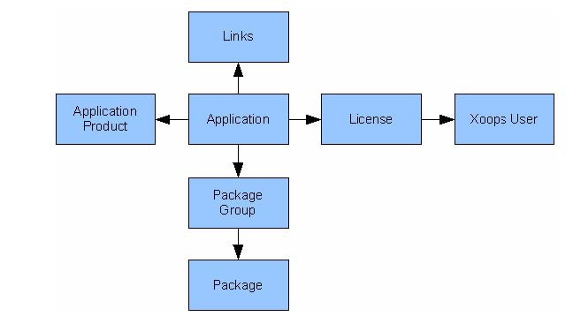
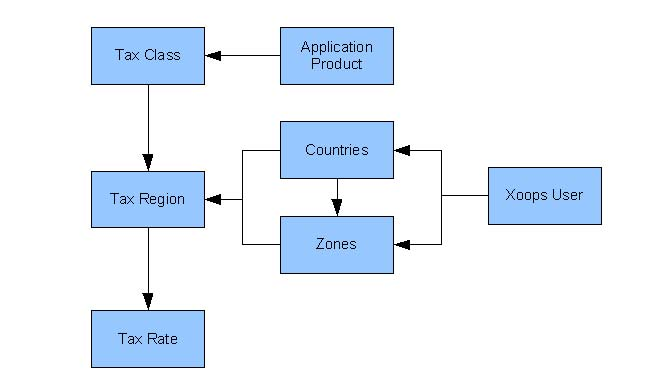
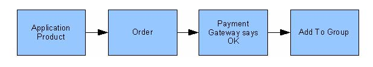

# Introduction

#### 

**XAsset** is a Xoops module designed for digital media sales and distribution. Initially this was designed for Shareware authors but the module architecture can also be extended to selling and distributing any digital asset such as MP3 files, EXE files or PDF documents. Anything that can be downloaded can be managed from xAsset.

As can be seen, the Application is central to xAsset. The application can be seen as the top level object that describes a particular application that is being sold. Another way of looking at an application is thinking of it as a Music album. An album could have multiple tracks, in this case Application Products. An Application product can either describe the whole album \(£9.99 for the whole album\) or it can describe an individual track \(£0.99 per track for example\). The Application Products describes your price structure for the Application. An Application can have multiple Application Products.

The Applications physical attributes \(ie files\) are described via the Package Groups and Packages. Packages describe files where a Package Group groups together Packages. An application can have multiple Package Groups and a Package Group can contain multiple files.

Tax always creeps up when selling anything! xAsset supports multiple tax levels by defining geographic tax regions and setting appropriate tax rates for each region. The Tax structure is as follows:

* Each Country can have many zones defined. This structure could be used to describe the USA, as a country, and its states as zones.
* A tax region can be defined by pairing a Country and a Zone. Tax Regions are used to describe geographic locations where extra tax handling is required. An example would be Region 1 where USA is defines with all zones. This describes a federal tax for example. Region 2 can then be defined to group the USA and New York zone together. This can then define an additional state tax. When a client chooses New York as his state/zone, she will be liable for federal tax \(Region 1\) and a state tax \(Region 2\).
* Each application must have a Tax Class defined, ie "Taxable Goods". This Tax Class can then be set a Tax Rate depending on the Tax Region. This allows you to set the Tax Class "Taxable Goods" and assign a 5% federal tax \(Region 1\) and a 7% tax \(Region 2\) using the above example. Non taxable goods must be assigned a tax of 0%.
* Each client must specify both their Country of Origin and a State/Zone, if one is defined. This is then used to calculate the appropriate tax.

Please read the Tax & Rates section for more information.

#### Item Ordering Workflow

There are two types of products that can be sold through xAsset:  
1. Media based assets. This can be a pdf file, a zip file, mp3 file etc. Any file that can be bought and downloaded.  
2. Service asset. This is a service and as such does not have a corresponding file and cannot be downloaded.

#### Asset Based Order Workflow

An Application product can have a Package Group assigned to it. A Package group can contain any number of files. Once an application product is ordered it is placed in the Order table and can immediately be seen by the client in the My Downloads section once the client has proceeded to the payment gateway.

Items shown in the My Downloads section only be live and downloadable once the payment gateway has confirmed that a payment was received. In the case of Paypal this is triggered via an IPN callback.

#### Permission Based Order Workflow

Alternatively, an application product can be instructed to add the client to a Xoops Group. Where no Package Group is specified, the client is added to the specified Xoops Group once a successful message is received from the payment gateway.

Please note that the above two mechanisms can be combined. ie, an application product can be specified contains a package group and at the same time adds the client to the specified Xoops Group.

