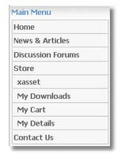
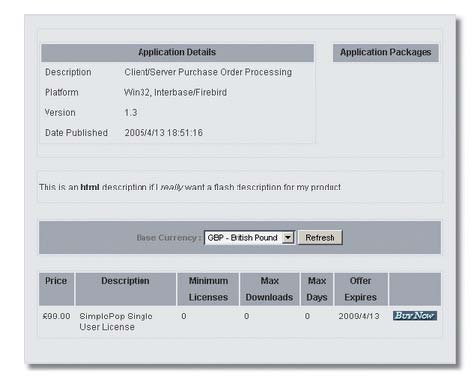
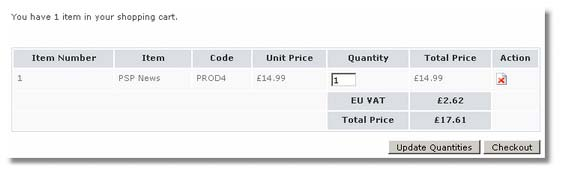
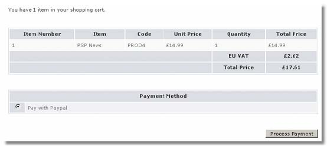
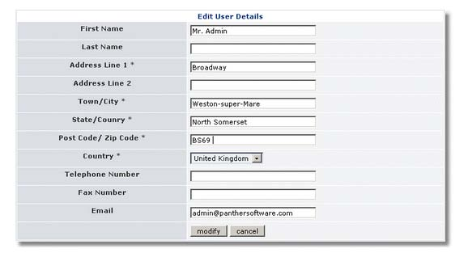

# The User Side

## Overview

XAsset presents clients with four menu options:

* If any Applications have been defined with Display in Main Menu they will be shown above as is the example with Album and Album Singles.
* My Downloads. Once an Application has been ordered and successfully returned from the payment gateway the purchased application's packages will be available for download.
* My Cart : Displays to the client their current cart contents.
* My Details : XAsset stores extra user information, such as first name, last name, address and most importantly the country of residence as the later is used to determine the appropriate Tax Rate to charge.

## Product Page

The product page lists all applications that have been listed in the Application setup screen in the xAsset Control Panel.

Clients will be presented with your application details and Application Products with the respective prices. The Application Products grid can be customised by enabling or disabling displayed columns. This can be done in the xAsset Properties page in the Control Panel.

If multiple currencies will be presented to clients if this has been setup on our site. This will allow them to select their native currency and re-adjust Application Product prices to the selected currency's exchange rate. Please note that the currency selector is now available as a block and must be enabled from Xoops -&gt; Admin -&gt; Blocks if you intend to support multi-currencies.

Clients can add Application Products to their shopping cart by pressing the Buy Now button. If the client has never used your site before she will be required to add their details to the xAsset system. This will be done by redirecting the client to the My Details screen where required information must be populated. The client will then be redirected to their cart.

Clicking on the same Buy Now button several times will increase the quantity of the specific Application Product. Clients are then directed to their Cart.

## My Cart

Clients can view their shopping carts anytime by clicking the My Cart link in the Xoops main menu. Clients will be able to either adjust the Quantity required or remove the cart item from their shopping cart.

Tax Rates, if applicable, will be presented to the client at this stage and the total price for their cart so far.

On pressing the Checkout button the client will be able to choose a Payment method if multiple payment gateways are installed. XAsset provides the Paypal gateway by default. Pressing the Process Payment button will redirect the user to their chosen payment gateway.

## My Details

Each client must register their details with xAsset to continue to their shopping cart. The most important field here is the Country as that is used to determine the correct Zone and consequently the correct Tax Rate, if any. A client will also be asked to select a Zone, if any were defined for the selected country. A text field for the State/Country will be presented if no Zones were defined for the selected country.

Other client data is passed to the payment gateway to populate payment gateway fields \(like name, address, etc...\). The client has to this only once.

